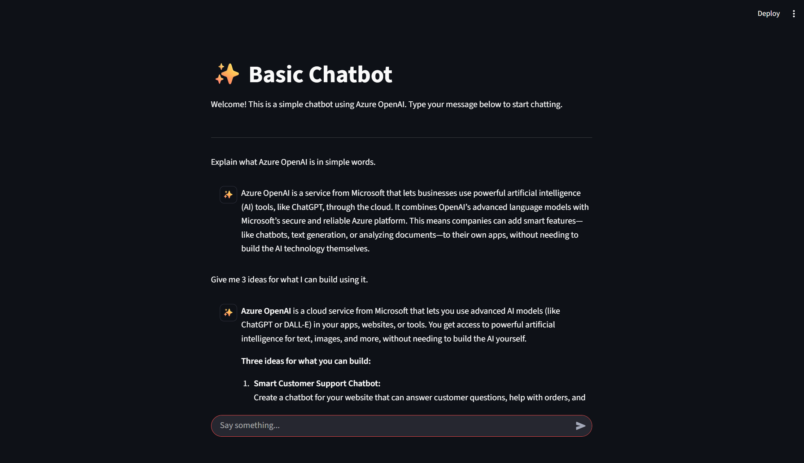

# BasicChatbot – Streamlit UI Version

A simple chatbot with a graphical web interface built using **Streamlit** and powered by Azure AI Foundry.



## Features
- Web-based chat UI using Streamlit
- Connects to Azure OpenAI / AI Foundry
- Real-time response from GPT model
- Clean and simple interface
- Easy to run locally

## Requirements
- Python 3.10+
- Libraries:  
  `streamlit`, `openai`, `azure-identity`, `requests`
- Azure AI account with GPT model deployed

## Setup & Run

### 1. Install libraries
```bash
pip install streamlit openai azure-identity requests

### 2. Set environment variables
```bash
set ENDPOINT_URL=https://<your-foundry-endpoint>.openai.azure.com/
set DEPLOYMENT_NAME=gpt-4
set AZURE_OPENAI_API_KEY=<your-api-key>

### 3. Run the Streamlit app
```bash
streamlit run app.py

### 4. Open in browser
```bash
Streamlit will open the chatbot UI automatically.
If not, open the link shown in the console (usually at http://localhost:8501).

### Notes
This version focuses on a visual chat interface.
For the CLI-based chatbot, switch back to the main branch.
